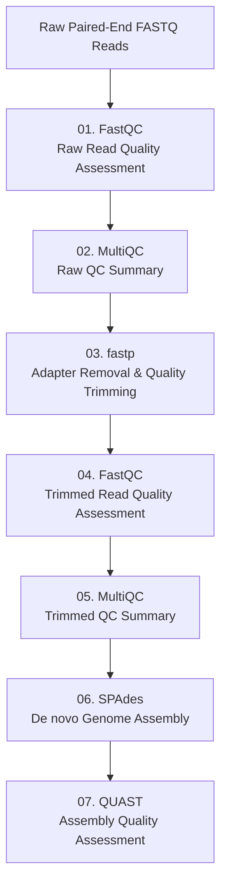

# Genome_Assembly_Pipeline
An automated SLURM based pipeline for quality control, read trimming, genome assembly, and assembly quality assessment.

##  Pipeline Workflow



## Repository Structure

```text
Genome-Assembly-Pipeline/
├── README.md
├── scripts/
│   ├── 01_fastqc_raw.slurm
│   ├── 02_multiqc_raw.slurm
│   ├── 03_fastp.slurm
│   ├── 04_fastqc_trimmed.slurm
│   ├── 05_multiqc_trimmed.slurm
│   ├── 06_spades.slurm
│   └── 07_quast.slurm
├── example_output/
└── images/
```

## Software Requirements

- FastQC
- MultiQC
- fastp
- SPAdes
- QUAST
- SLURM Workload Manager

## Execution Order

Run the scripts in the following order:

1. 01_fastqc_raw.slurm
2. 02_multiqc_raw.slurm
3. 03_fastp.slurm
4. 04_fastqc_trimmed.slurm
5. 05_multiqc_trimmed.slurm
6. 06_spades.slurm
7. 07_quast.slurm

## Input

Paired-end Illumina FASTQ files

Example:

- sample1_1.fastq.gz
- sample1_2.fastq.gz

## Output

The pipeline generates:

- FastQC reports (raw reads)
- MultiQC summary report (raw reads)
- Trimmed FASTQ files
- FastQC reports (trimmed reads)
- MultiQC summary report (trimmed reads)
- SPAdes genome assembly
- QUAST assembly quality report

## Features

- Modular SLURM scripts
- Variable-based configuration
- Easy to customize for new datasets
- Suitable for HPC environments
- Reproducible genome assembly workflow

## Author
Chhavi Patial

B.Sc. (Hons.) Bioinformatics
